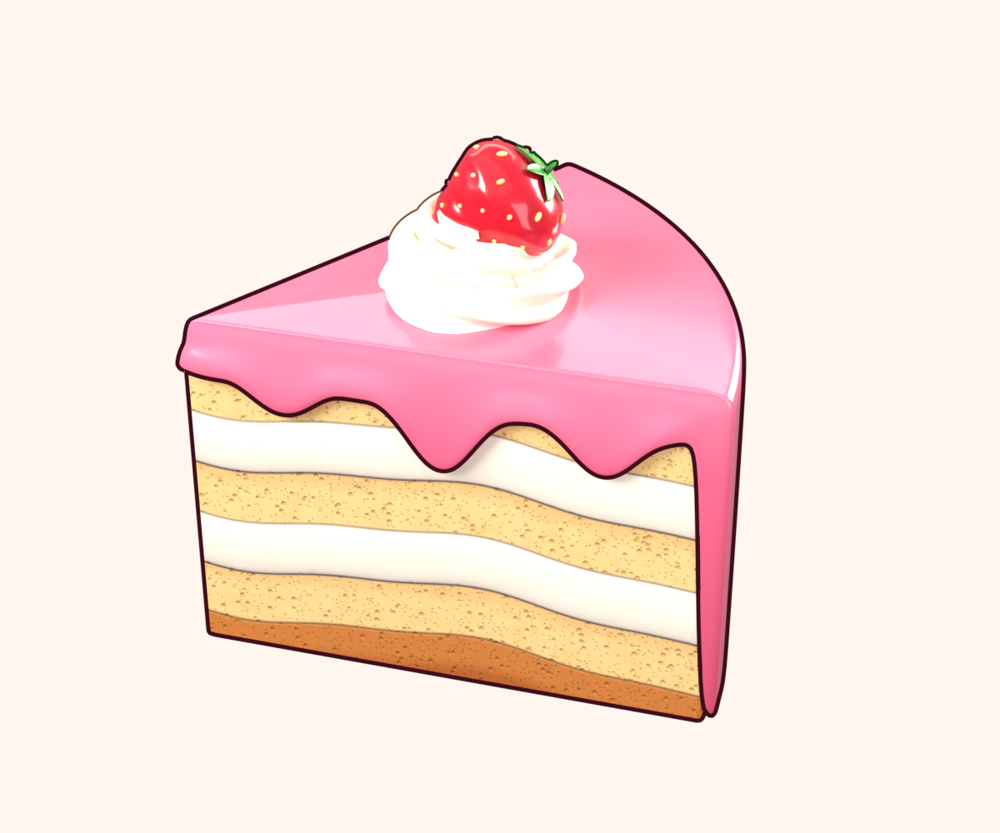
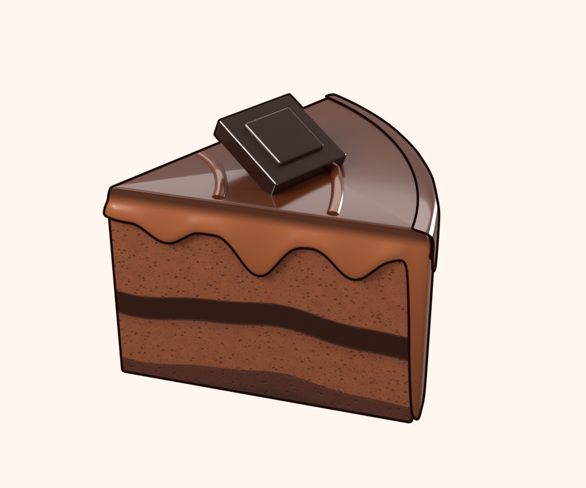
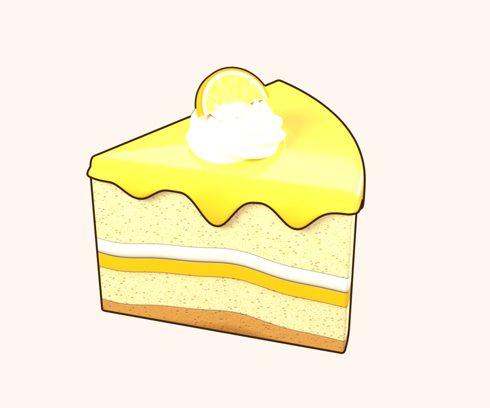
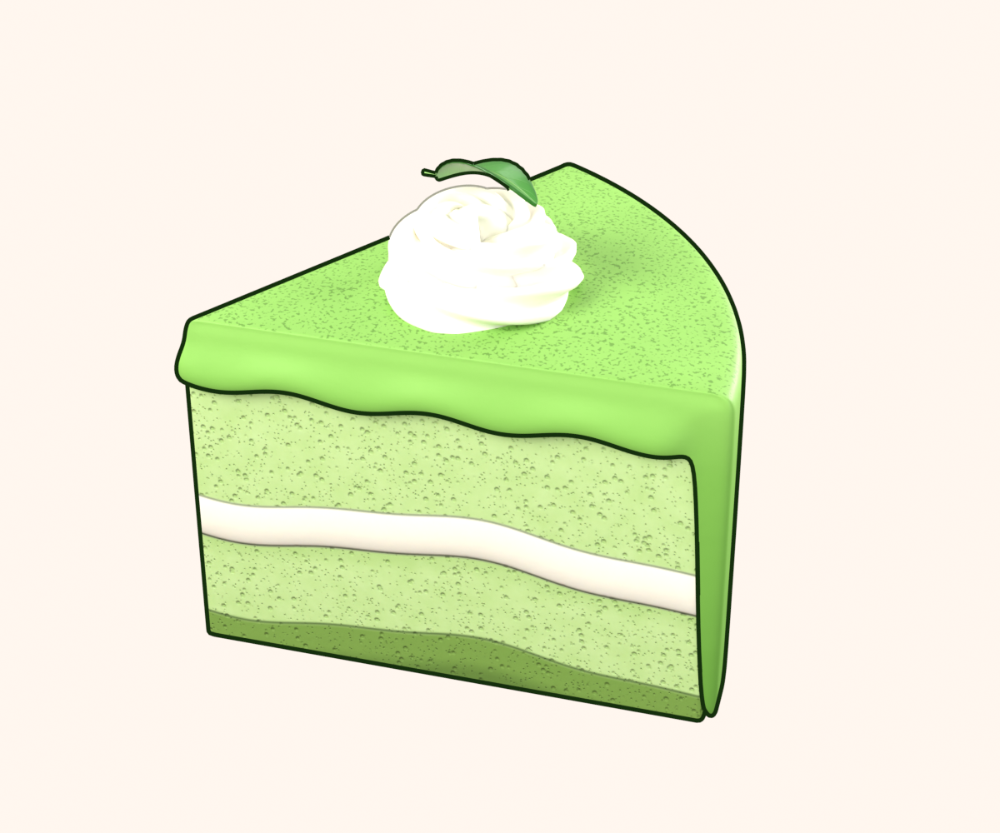
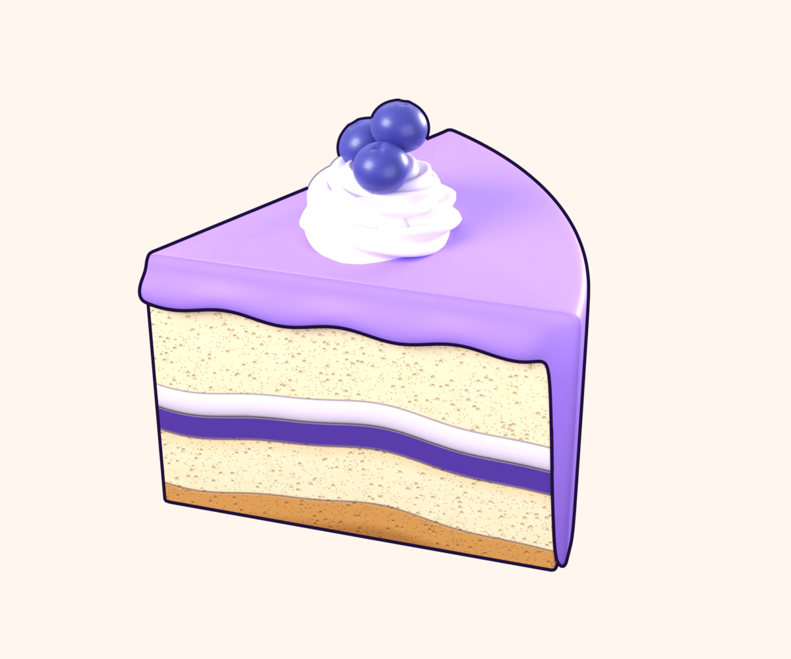
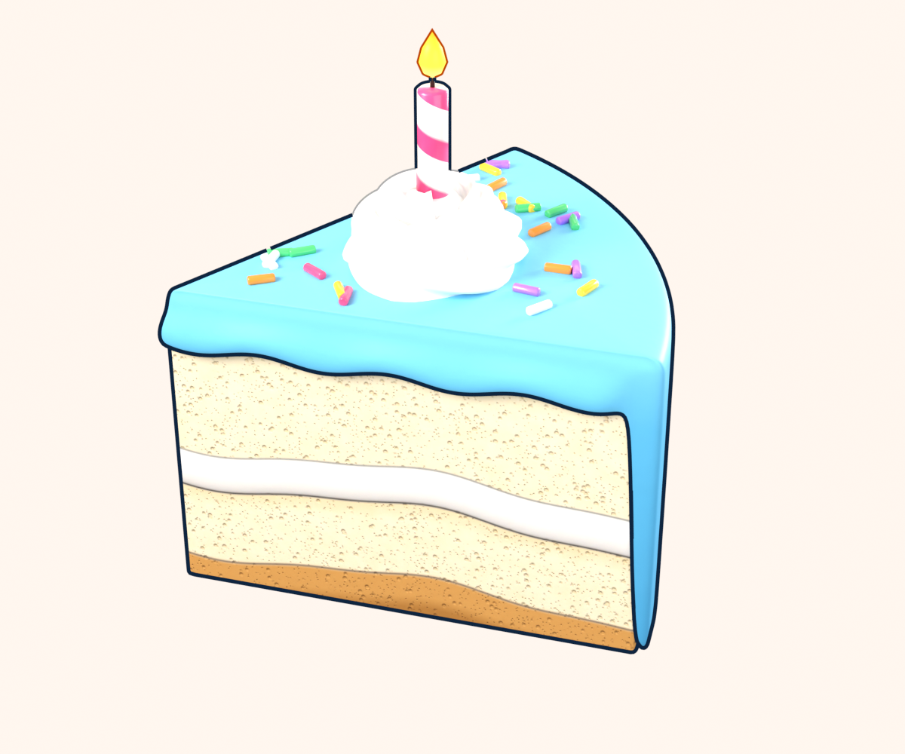
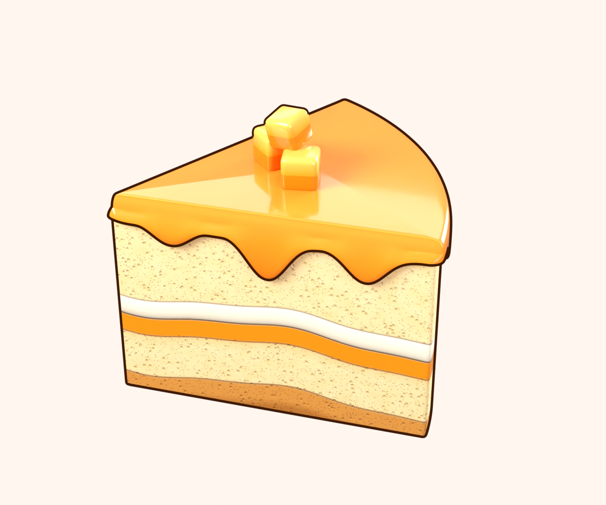
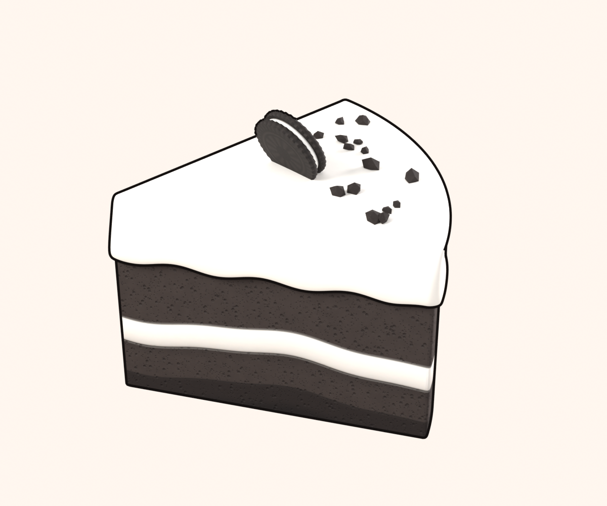
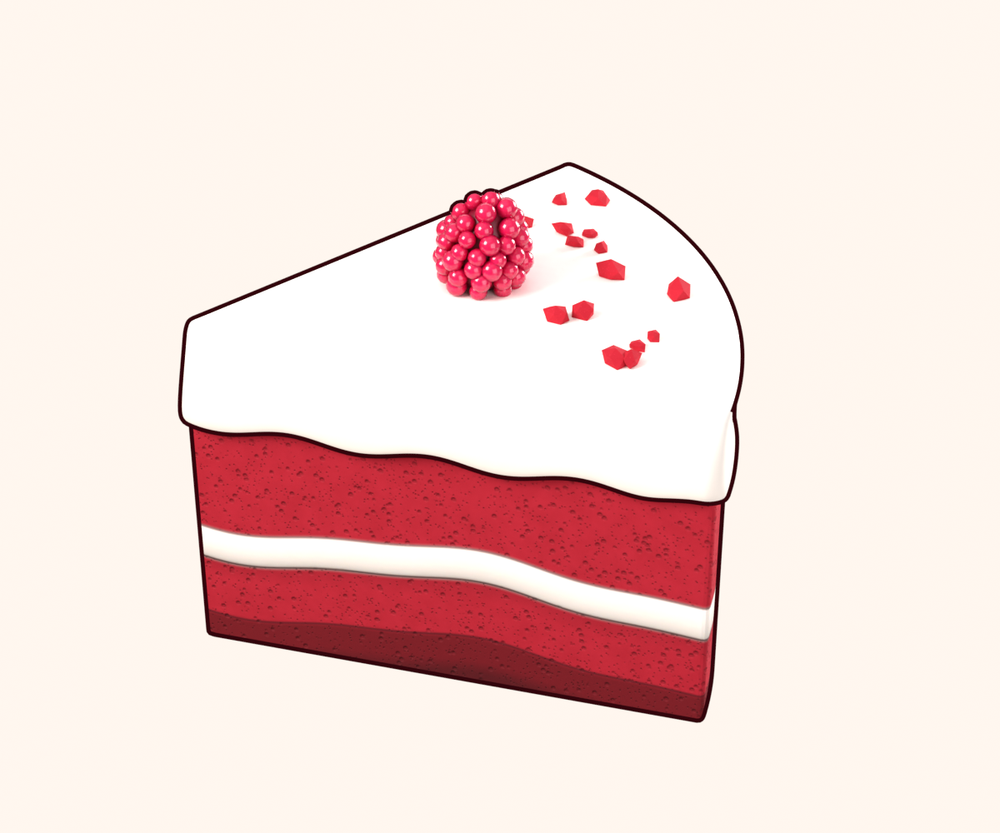
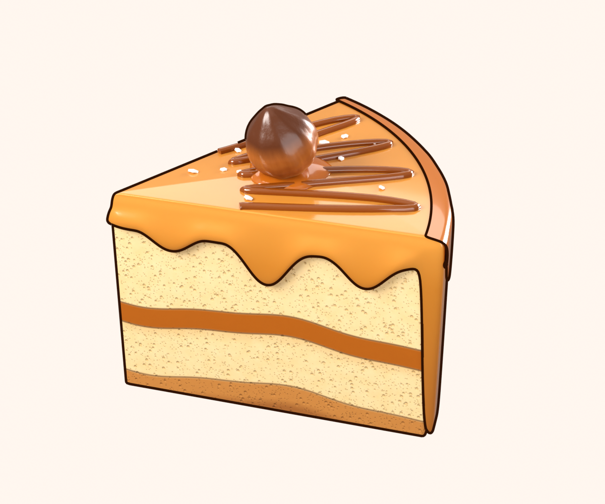

# Cake Sort: the slices in 3D

One slice of each of the ten cakes, modelled, shaded and rendered in Blender 4.2, each with its game asset (a
GLB of at most 1,200 triangles with a baked 512 atlas). They share one look: the approved Strawberry slice is
the reference, and the others follow the designs the game draws in 2D today (`playbox/src/games/cake-sort.html`,
`CAKES`): the same layers, coats, patterns and toppings.

Everything is generated by one script, from the cake's entry in `cake_specs.py`:

    blender -b -P cake_slice.py -- --cake NAME --out NAME --glb --views hero,game,single,lodviews

| File | What it is |
| --- | --- |
| `cake_slice.py` | The build: the sponge, the coat, the cream, the game mesh, the bake, the GLB, the checks, the renders, each cake's README |
| `cake_specs.py` | What each cake is made of: sponge, fillings, coat, piping, pattern, topping, ink |
| `cake_toppings.py` | The toppings and the patterns on top, hi-res and game versions |
| `cake_common.py` | Shared units (radius 1, height 0.71, the game camera's 42.84 degrees) and helpers |

Each cake's folder has its README (the Unity outline decoding, the material, the checks), the GLB, the textures and
the renders. Every slice tiles a whole cake (no visible overlap with its neighbours, no ray reaching a sponge cut
face from outside) and every game mesh is closed to the game camera (no back face first, lone or as a cake).

| Cake | Hero render | Coat; topping; top | Game triangles | Back-face holes (lone / cake) | Ink |
| --- | --- | --- | --- | --- | --- |
| [Strawberry](strawberry/) |  | frosted to the counter; a strawberry on a cream rosette; top: - | 1156 | 0 / 0 | `#4A1626` |
| [Chocolate](chocolate/) |  | frosted to the counter; an embossed chocolate square; top: swirl | 368 | 0 / 0 | `#24100A` |
| [Lemon](lemon/) |  | bare sides, dripping glaze; a candied lemon half-wheel on a rosette; top: - | 1000 | 0 / 0 | `#4A3008` |
| [Matcha](matcha/) |  | frosted to the counter; a tea leaf on a rosette; top: dust | 1000 | 0 / 0 | `#1F3A16` |
| [Blueberry](blueberry/) |  | frosted to the counter; three blueberries on a rosette; top: - | 1160 | 0 / 0 | `#2A1A4A` |
| [Birthday](birthday/) |  | frosted to the counter; a lit striped candle on a rosette; top: sprinkles | 1030 | 0 / 0 | `#18304A` |
| [Mango](mango/) |  | bare sides, dripping glaze; three mango cubes; top: - | 456 | 0 / 0 | `#4A2408` |
| [Cookies & Cream](cookies/) |  | bare sides, thick cream top; a sandwich cookie; top: crumbs | 468 | 0 / 0 | `#1E1A19` |
| [Red Velvet](redvelvet/) |  | bare sides, thick cream top; a raspberry; top: crumbs | 422 | 0 / 0 | `#3E0A14` |
| [Caramel](caramel/) |  | frosted to the counter; a hazelnut on a caramel dollop; top: drizzle | 490 | 0 / 0 | `#3A1C08` |
