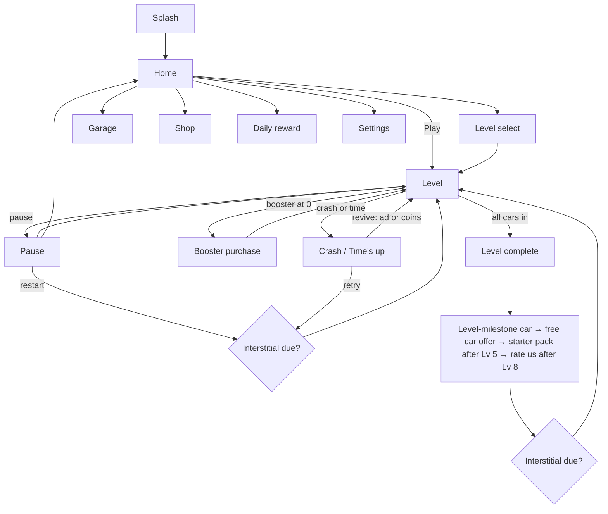

# Roundabout Rush: design and Unity handoff

The prototype is `index.html`. This document covers what it does, why, the
numbers it runs on, and what the Unity build should copy exactly.

---

## 1. The reference

**Car Circle** by Shoom Games (Poki, released June 2026, 4.1/5 from ~115k votes,
trending in Skill games). Played headlessly for this brief. What it is:

- A ring road (circle, rounded square, stadium…) on a dark navy ground, with the
  level number printed faintly in the middle of the island.
- A feeder road from the bottom holds a queue of your cars. Tap: the front car
  pulls out and merges. Every car on the ring moves at the same speed.
- From level 2 other-coloured traffic is already circling, so each tap has to
  land in a gap. Level 4 moves the feeder off-centre.
- All cars in: the island flashes green and the next level starts. A crash: the
  wrecks fly off, the island pulses red, and a tap restarts the level.
- One input, read in a second, failure is instant and funny. Its description
  promises a clock ("beat the clock before time runs out"); no clock was
  visible in levels 1–4.

## 2. What the prototype keeps, and what it adds

Kept as-is: the ring, the feeder, the shared speed, the tap, the level number in
the island, green and red island flashes, wrecks thrown off the road.

Added, each for a reason:

| Addition | Why |
| --- | --- |
| A visible clock and 1–3 stars | Gives the waiting game a cost. Without it, the safe play is always "wait for an empty ring", which is boring. With it, every tap trades safety for time. |
| Close-call bonus (+3 coins) | Rewards the risky merge the clock pushes you toward. The best moment in the reference is the near miss; now it pays. |
| Variations on a schedule | Counter-clockwise rings, two entrances, rush-hour speed surges, hard levels. One new idea at a time, each introduced with a one-line tip. |
| Four boosters | The relief valve on hard levels and the main coin sink. |
| Garage of 12 cars | A collection goal and the second coin sink. Rarer cars add a small coin bonus, never a gameplay edge. |
| Revive on crash or time-out | The highest-intent rewarded-ad moment in the game. |

## 3. Core rules (implement exactly)

- **Track:** a closed loop sampled into points 1 world unit apart. Every car on
  the ring has a distance `s` along it; position and heading are read from the
  table. Road width 30, car 24 × 13.
- **Feeder:** a vertical road under the ring that meets it with a smooth bezier
  turn (radius 36). Cars queue on it 34 units apart. Front car sits on the stop line.
- **Motion:** one world speed `V(t)` for everything: ring cars, merging cars and
  the queue shuffling up. Rush-hour levels make `V` swing with a sine wave.
- **Tap:** releases the front car if it is on the stop line; otherwise the tap
  is held for 0.3 s and fires when the car arrives. The clock starts on the first tap.
- **Collision:** each car is two circles (front and back, 5.6 from centre). A
  crash is any pair of circles closer than 11.1, checked only while a car is
  merging and for 16 units after it joins the ring. Cars already on the ring can
  never collide with each other, because they share one speed.
- **Win:** every player car is on the ring and has finished merging.
- **Lose:** a crash, or the clock reaching zero.

### The fact that makes everything else work

Because every moving car shares one speed, the gap between a car you release and
any other car is **fixed at the moment you tap**. So whether a tap crashes
depends only on where the other cars are when you tap. Each feeder has a
**danger interval**: the offsets at which a ring car will be hit. It is
`[-22, +22]` units on every track shape tested: pure bumper-to-bumper overlap, with
no extra unfairness from the merge curve.

That one precomputed interval drives:

- the **Green Light** booster (is any car in the zone now, or about to be?),
- the **Autopilot** booster (release the moment the zone is clear),
- the red / amber / green **teaching zone** on levels 2–3,
- the level **validation bots** and the **clock** (section 4).

In Unity, do not use the physics engine for cars. Move them by distance along
the sampled spline and run the two-circle check yourself, or the predictor
and the real collisions will drift apart.

## 4. Levels

### Hand-made levels 1–10

| Lv | Shape | Traffic | Cars | Speed | Teaches |
| --- | --- | --- | --- | --- | --- |
| 1 | circle | 0 | 5 | 120 | tap (pointer hand, 30 s clock) |
| 2 | rounded square | 2 | 4 | 125 | wait for the gap (danger zone shown) |
| 3 | tall stadium | 4 in pairs | 4 | 130 | gaps come in sizes (zone shown) |
| 4 | rounded square | 4 random | 5 | 134 | off-centre entrance · **Slow-Mo** unlocks |
| 5 | circle | 5 in threes | 5 | 137 | big gaps between trains |
| 6 | wide stadium | 5 even | 6 | 140 | **Green Light** unlocks |
| 7 | triangle | 5 random | 6 | 142 | short ring |
| 8 | circle, reversed | 6 in pairs | 6 | 145 | counter-clockwise |
| 9 | hexagon | 6 random | 6 | 148 | **Tow Truck** unlocks |
| 10 | rounded square | 7 in pairs | 7 | 152 | first **hard** level (×2 coins) |

### Generator, level 11 onward

Seeded per level number (mulberry32), so level 37 is the same for everyone:

| Parameter | Rule |
| --- | --- |
| Shape | random from 10: circle, big circle, rounded square, rounded rect, tall / wide stadium, tall rect, triangle, hexagon, pentagon |
| Direction | counter-clockwise 38% of the time |
| Traffic pattern | even, pairs, threes, random (random twice as likely) |
| Speed | `148 + 0.75·(n−10)`, capped at 185, ±5% random after level 60; hard levels +6 |
| Cars in total | sized to the ring: `capacity = 2 × ringLength / (47 + 0.3·speed)` (a cautious player needs a gap of about `47 + 0.3·speed` units to merge). Each level fills `55% → 88%` of capacity on a square-root curve by level 80, ±8% random, +8% on hard levels, −10% on rush hour; at least 7 cars |
| Your cars | half the total (±0.6), clamped 5–10; the rest is traffic, at least 2 |
| Hard | every level ending in 0, and in 5 after level 20 |
| Two entrances | levels 16, 21, 26, … (n mod 5 = 1) |
| Rush hour | levels 15, 19, 23, … (n mod 4 = 3): speed ×0.92, ±15–27% surge every 3.2–4.8 s |
| Autopilot unlocks | level 13 |

### Validation and the clock

A level only ships if three bots can clear it:

1. **Greedy:** taps on the first safe frame. Must clear it with room for at
   least 2 more cars (1 after level 25), so the ring never packs solid.
2. **Reference player:** plans each tap 0.35 s ahead, aims at the middle of the
   first gap wider than ±0.12 s, never taps twice within 0.25 s. Must clear it
   in under 20 s.
3. **Cautious player:** 0.45 s ahead, ±0.15 s margin, 0.35 s between taps. Must
   clear it at all.

If any fails, the level drops a traffic car and tries again (and after four
tries, one of your cars too). With the capacity sizing above, about a third of
levels need one or two retries and a level takes ~12 ms to build; the next level
is generated while the level-complete panel is on screen. Then:

```
clock = ceil( max( referenceTime × slack + 2 ,  cars × 1.2 + 3 ) )
slack = 2.2 for levels 1–3, then 2.0 → 1.4 across levels 4–64
        × 0.95 on hard levels, × 1.15 on two-entrance levels
```

Level 1 is fixed at 30 s. Clocks land between 9 and 34 s.

**For Unity:** port `rawDef`, `levelDef`, `greedySolve`, `refSolve` and
`planTap` as they are, then bake levels 1–300 to data (ScriptableObject or
JSON) with a script. Baked levels stay identical across app updates and can be
hand-edited or remotely tuned per level; generate at runtime only past the baked set.

## 5. Measured balance

Two simulated humans played levels 1–100, six attempts each, through the real
game code. Both plan taps ahead like the reference player and add timing noise:

- **Skilled:** 0.35 s ahead, ±0.10 s margin, σ 0.06 s timing error.
- **Casual:** 0.45 s ahead, ±0.15 s margin, σ 0.09 s timing error, slower taps.

| Levels | Speed | Clock | Skilled: win · crash · time left · 3★ | Casual: win · crash · time left · 3★ |
| --- | --- | --- | --- | --- |
| 1–10 | 137 | 16.7 s | 98% · 2% · 60% · 98% | 95% · 5% · 51% · 77% |
| 11–20 | 150 | 15.7 s | 98% · 2% · 57% · 98% | 98% · 2% · 48% · 75% |
| 21–40 | 161 | 13.4 s | 99% · 1% · 54% · 92% | 91% · 8% · 39% · 46% |
| 41–60 | 176 | 14.2 s | 97% · 3% · 50% · 86% | 86% · 10% · 34% · 37% |
| 61–80 | 182 | 12.2 s | 98% · 2% · 45% · 72% | 77% · 4% · 24% · 8% |
| 81–100 | 182 | 12.7 s | 97% · 3% · 45% · 75% | 71% · 4% · 22% · 12% |

Average traffic grows from 3.9 cars (levels 1–10) to about 6, and your cars from
5.4 to 6.5.

That is the intended curve: almost nobody fails the first 20 levels, casual
players start needing a second try in the 40s and 50s, and three stars stay
attainable for good players throughout. The spikes are where they should be:
the casual bot's hardest levels are 70, 81, 85, 65 and 88, nearly all hard,
two-entrance or counter-clockwise. Those are the levels where boosters and
revives earn their keep.

**How the first versions failed, and why the bots exist:**

1. The first clock was based on the greedy bot alone. It fills a ring in about
   2 s by tapping on the exact frame a gap opens, and human-like bots then lost
   every level from 7 onward.
2. Traffic first grew on a fixed curve. Past level 60 it outran what the ring
   could hold, so the validator spent 3–8 s per level stripping cars out (a
   visible freeze at level start) and late levels ended up *easier*. Sizing
   traffic from ring capacity fixed both.

Re-run the probes through `window.__rr` after any change to speeds, traffic or
the clock formula.

## 6. Boosters

| Booster | Unlock | Effect | Pack price | Free routes |
| --- | --- | --- | --- | --- |
| Slow-Mo | Lv 4 | World speed ×0.42 for 6 s. The clock slows too. | 3 for 250 | intro gift ×2, daily day 3, starter pack |
| Green Light | Lv 6 | 15 s of traffic light + coloured danger zone: red = crash now, amber = closing, green = go | 3 for 250 | intro ×2, daily day 5 |
| Tow Truck | Lv 9 | Bullet time; tap a traffic car and a crane lifts it away for good. Not charged if cancelled. | 3 for 375 | intro ×2, daily day 7 |
| Autopilot | Lv 13 | Next 3 taps arm the car; it waits at the line and goes on the first safe frame. | 3 for 450 | intro ×2, daily day 7 |

With zero left, the booster button shows **+** and opens a purchase panel:
buy a pack with coins, or watch a rewarded ad for one.

## 7. Economy

**Currency:** coins only. A hard currency was left out on purpose; one number is
easier to read and nothing yet needs a premium tier.

| Source | Amount |
| --- | --- |
| Level clear | `min(150, 25 + 1.5·level)` × stars (1★ ×1, 2★ ×1.25, 3★ ×1.5) × 2 on hard × (1 + car bonus) |
| Multiplier needle (rewarded) | the clear payout ×2, ×3, ×4 or ×5, wherever the needle stops |
| Close call | +3 each |
| Daily reward | 100 → 150 → boosters → 250 → boosters → 400 → 500 + boosters; ×2 with an ad |
| Free coins (shop, rewarded) | +100, 3-minute cooldown |
| Not enough coins (rewarded) | +100 |
| Coin packs (IAP) | 1,000 / 3,000 / 8,000 / 20,000 |

| Sink | Price |
| --- | --- |
| Booster packs | 250–450 |
| Revive | 150, then 300 (max 2 per attempt; or watch an ad) |
| Cars | 300 – 7,500 |

A typical clear pays 50–150 coins before the multiplier.

### Garage

| Car | Body | Rarity (coin bonus) | Unlock |
| --- | --- | --- | --- |
| Zippy | compact | Common | starter |
| City Cab | taxi | Common | 300 coins |
| Mint Hatch | hatchback | Common | 500 coins |
| Patrol | police | Rare (+5%) | 3 rewarded ads |
| Ranger | pickup | Rare (+5%) | 900 coins |
| Vento GT | sports | Rare (+5%) | 1,400 coins |
| Medic | ambulance | Rare (+5%) | reach level 15 |
| Brute | muscle | Epic (+10%) | 2,200 coins |
| Hauler | van | Epic (+10%) | 3,000 coins |
| Bolt R | open-wheel racer | Epic (+10%) | 6 rewarded ads |
| Aurum | supercar | Legendary (+20%) | 7,500 coins |
| Neon X | cyber | Legendary (+20%) | reach level 40 |

Every car has the same hitbox; skins never change difficulty. Traffic colours
are picked per level to avoid any hue within 38° of your car, so your cars are
always readable.

**Free-car progress bar:** each clear adds `12% + 3% × stars`, shown on the
level-complete panel. At 100% the cheapest coin car you don't own is offered
for one rewarded video ("No thanks" resets the bar). About one car every 5–7
levels.

## 8. Ads and store

Placement names are the `placement` strings in the code; keep them as the ad
network placement IDs so analytics lines up.

| Format | Placement | Trigger | Rules |
| --- | --- | --- | --- |
| Banner 320×50 | home, gameplay, all screens | always | hidden after Remove Ads; the game layout reserves 58 px for it |
| Interstitial | between levels | after "Continue" on a clear | not until level 3 is beaten; at most every 2nd clear; ≥ 45 s apart; not within 30 s of a rewarded view |
| Interstitial | retry | Retry after a fail | every 3rd retry, same time gates |
| Rewarded | `revive_crash`, `revive_time` | fail panel, 8 s countdown | continue where you were; crash wreckage removed |
| Rewarded | `level_multiplier` | level complete | ×2–×5 needle |
| Rewarded | `booster_<id>` | booster purchase panel | +1 booster |
| Rewarded | `gift_car` | progress bar full | the car |
| Rewarded | `car_patrol`, `car_bolt` | garage | 1 of 3 / 6 views |
| Rewarded | `daily_double` | daily reward | ×2 |
| Rewarded | `shop_free_coins`, `no_coins` | shop, not-enough-coins | +100 coins |

Rewarded videos always pause the game and the audio, can be closed early with a
"you will lose the reward" confirmation, and fail gracefully on no fill (toggle
**No ad fill** in Settings → Developer tools to see it). Remove Ads removes
banners and interstitials only; rewarded videos stay, because the player chooses them.

| Store product | Price | Contents |
| --- | --- | --- |
| `noads` | $3.99 | no banners, no interstitials |
| `starter` | $1.99 | Remove Ads + 2,000 coins + 3 of each booster; offered once after level 5, then on the home screen |
| `coins1`–`coins4` | $0.99 / $2.99 / $4.99 / $9.99 | 1,000 / 3,000 / 8,000 / 20,000 coins |

## 9. Screen flow



Every panel in the prototype, for the UI build:

| Panel | Opens from | Content |
| --- | --- | --- |
| Splash | launch | logo, loading bar, rotating hints |
| Home | splash, any Home button | live attract-mode roundabout, Play (shows level), Garage, Levels, Shop, settings, daily (red dot when ready), Remove Ads, starter offer, coins |
| Level select | home | 5-wide grid, stars, locks, hard markers, current level pulses, total stars |
| Gameplay HUD | level start | pause, level + HARD chip, clock bar (green → red pulse at 5 s, blue in Slow-Mo), coins, car pips, booster bar |
| Level intro | level start | "LEVEL 7" plus a tag for hard / two roads / rush hour / reversed |
| Tutorial tips | levels 1, 2 and first sight of each variation | bubble + pointer hands |
| Pause | pause button, app backgrounded | sound / music / vibration toggles, resume, restart, home |
| Settings | home gear | toggles, privacy policy, restore purchases, replay hints, developer tools |
| Level complete | win | stars, time left, close calls, car bonus, coin payout, multiplier needle, free-car progress |
| Crash / Time's up | lose | cars made it in, 8 s revive countdown with ad and coin options, retry, home |
| Booster intro | first level at unlock | booster art, description, ×2 free |
| Booster purchase | booster with 0 left | buy pack, watch ad for 1 |
| Not enough coins | any failed purchase | watch ad +100, visit shop |
| New car | progress bar full, level milestone | spinning car, rarity, claim (ad) / equip |
| Starter pack | after level 5, home | contents, buy, no thanks |
| Rate us | after level 8, once | 5 stars; 4–5 → store review sheet |
| Daily reward | home | 7-day calendar, claim, claim ×2 |
| Store confirm | any IAP button | mock purchase sheet |
| Interstitial / Rewarded | see §8 | full-screen ad mock with countdown and close |

## 10. Analytics

The prototype logs these to `window.__rr.log`; wire the same names to
Firebase or GameAnalytics:

`level_start`, `level_complete`, `level_fail` (reason, cars in), `level_reward`
(coins, multiplier), `revive`, `booster_used`, `booster_bought`,
`ad_impression`, `ad_start`, `ad_reward`, `ad_skipped`, `ad_failed`, `iap_view`,
`iap_purchase`, `car_unlocked`, `car_bought`, `car_equipped`, `daily_claim`,
`rate_prompt`.

Watch these first: level-by-level fail rate and attempts per level (spikes),
revive take-up, multiplier take-up, day-1 retention against the interstitial
cadence.

## 11. Unity build notes

| Prototype | Unity |
| --- | --- |
| `resample()` loop table | Unity Splines package for authoring; bake to a 1-unit distance table at load |
| `stepWorld()` with ≤1.5-unit substeps | the same loop inside `Update`, fixed substeps; no Rigidbodies |
| `computeDanger()` | run once per feeder on level load (a few ms) |
| Level generator + bots | editor script that bakes levels to ScriptableObjects; runtime fallback past the baked set |
| `ECON`, `ADS`, `BOOSTERS`, `CARS`, `IAP` | ScriptableObjects, overridable by Remote Config |
| Save (`roundabout-rush-v1`) | JSON in `Application.persistentDataPath`, same fields; cloud save later |
| Mock ads | AppLovin MAX, Unity LevelPlay or AdMob mediation; one wrapper with `ShowRewarded(placement, callback)` and `MaybeInterstitial(reason)` |
| Mock store | Unity IAP, product IDs as in §8 |
| `navigator.vibrate` | a native haptics plugin (light / medium / heavy impacts) |
| Procedural art and synthesised audio | replaced by the assets in ASSETS.md |

Keep the game logic resolution-independent (world units) and fit the camera
to the track bounds plus queue peek, as `layout()` does; it already handles
phones from 360 × 640 up and tablets.

## 12. Risks

1. **It is a close copy of a live game.** The mechanic can't be owned, but
   the name, art, level look and store listing must be clearly your own.
   "Roundabout Rush" is a working title; check store and trademark
   availability before committing.
2. **The loop is thin.** Ten levels in, the variations carry the novelty.
   Planned next mechanics, each one more idea: exits that pull traffic off the
   ring, a slow bus that is longer than a car, roadworks closing part of the
   ring, a second lane, an ambulance you must never block.
3. **Short levels mean fast ad cadence.** At 15–20 s a level, "every 2nd clear"
   could mean an interstitial a minute; the 45 s gate is what protects
   retention. A/B test 45 / 60 / 90 s.
4. **Small screens.** Cars are about 24 px long on a 360 × 640 phone. Test real
   devices before shrinking anything else.
5. **The clock is the main fail state for careful players.** If playtests
   show frustration at time-outs, raise `slack`; if levels feel solved, lower it.
   Both are one-line changes in `levelDef()`.
